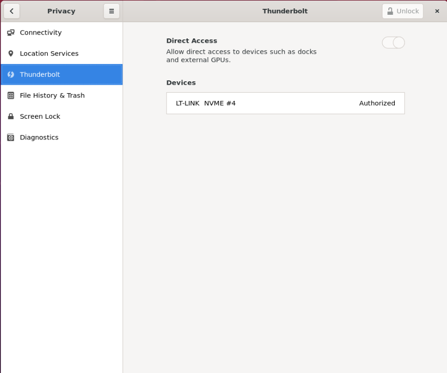
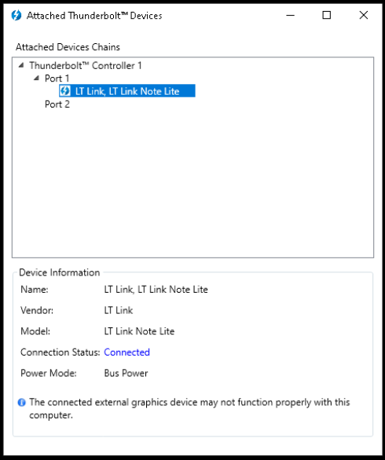
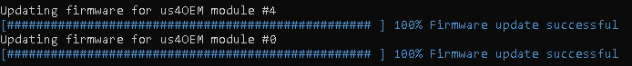
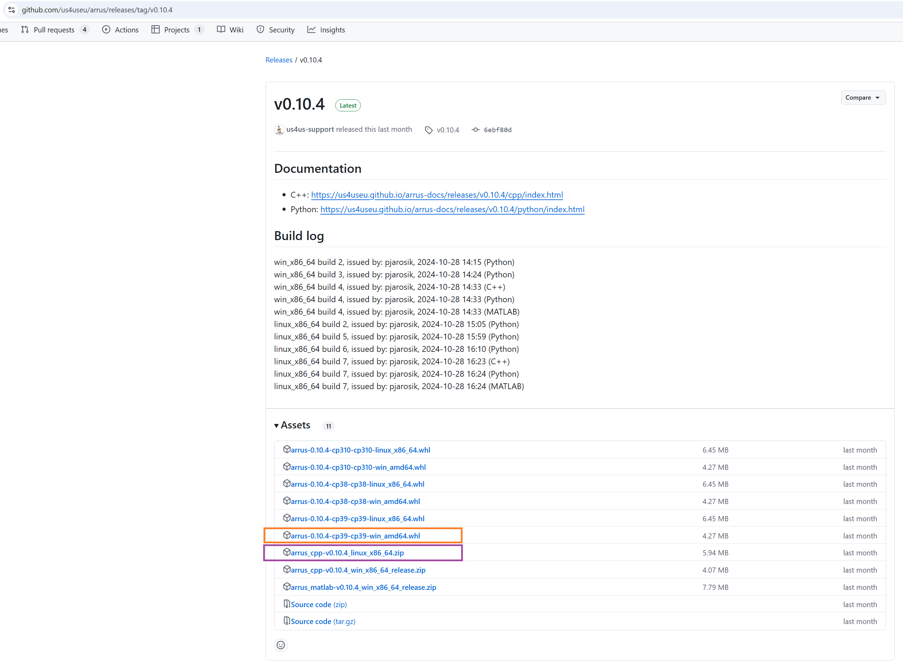

.. _arrus-toolkit-installation:

============
Installation
============

1. Follow instructions provided in the :ref:`arrus-toolkit-installation-preliminary` section.
2. Check if you have the correct version of the CUDA Toolkit installed.
   You can check what CUDA version is required by our software in the :ref:`arrus-toolkit-installation-separately` section, download required CUDA Toolkit from the NVIDIA download page `here <https://developer.nvidia.com/cuda-toolkit-archive>`_.
3. Download the current stable version of the Drivers according to the compatibility table presented in the :ref:`arrus-toolkit-installation-separately` section.
   For Linux drivers, just use the provided link. For Windows drivers, contact us4us support for the newest version.
4. Install the the us4R/us4R-lite drivers. For Linux follow the :ref:`arrus-toolkit-installation-separately-drivers-linux` instructions, for Windows follow the :ref:`arrus-toolkit-installation-separately-drivers-windows` instructions.
   This step requires us4R/us4R-lite to be powered on and connected to the host PC.
5. Download the current stable version of the ARRUS, according to the compatibility table in the :ref:`arrus-toolkit-installation-separately` section. How to choose the correct ARRUS package (for C++/Python/MATLAB) is described in the :ref:`arrus-toolkit-installation-separately-arrus` section.
6. Install the downloaded package according to the instructions in the :ref:`arrus-toolkit-installation-separately-arrus` section.

If, for any reason, a firmware update is required, please follow the instructions provided in the :ref:`arrus-toolkit-installation-separately-firmware` section.
Always ensure that compatible software, firmware, and hardware components are used; otherwise, when running the examples, a version incompatibility message for the software and firmware will appear.

.. _arrus-toolkit-installation-preliminary:

Preliminary steps
=================

Before you start the installation, please ensure that:

- your computer meets the following requirements:

    - operating system: Ubuntu 20.04 or newer is recommended, Windows 10 and Windows 11 are supported,
    - the host PC should have an NVIDIA GPU installed, with `Compute Capability <https://developer.nvidia.com/cuda-gpus>`_ >= 5.2,

- the ultrasound system is powered on and properly connected to the computer -- please refer to the us4R/us4R-lite User Manual for details. After connecting and powering on the ultrasound device, please reboot the host PC.

Depending on the communication interface between the ultrasound system and the
computer, additional steps may be required. In particular, it may be necessary
to change some of the operating system settings and/or to verify if the operating system
properly detects the connected system:

- for the Thunderbolt interface, please proceed to :ref:`arrus-toolkit-installation-preliminary-tb`, then to :ref:`arrus-toolkit-installation-preliminary-tb-pcie`,
- for the PCIe interface, please skip directly to :ref:`arrus-toolkit-installation-preliminary-tb-pcie`.

.. _arrus-toolkit-installation-preliminary-tb:

Thunderbolt-3 interface
-----------------------

For devices with **Thunderbolt-3** interface, please check if your us4R/us4R-lite
is properly connected via Thunderbolt-3 cable and is enabled in your System
Settings and/or Thunderbolt Software:

**Ubuntu 20.04 or newer**

Please check in the system settings → Thunderbolt the "LT Link" device is
authorized.

Alternatively, you can authorize the thunderbolt device from the command line
using the ``boltctl`` command (e.g. when you don't have access to the
graphical interface).

1. Run ``boltctl`` to determine uuid of the connected device.
2. Run as super user: ``boltctl enroll {uuid} --policy auto``, where ``{uuid}`` should be the uuid of the device.

::

 # boltctl
 o LT-LINK  NVME #4
   ├─ type:          peripheral
   ├─ name:          LT-LINK NVME
   ├─ vendor:        LT-LINK
   ├─ uuid:          00a1809d-414f-1502-ffff-ffffffffffff
   ├─ status:        connected
   │  ├─ domain:     cf030000-0090-8718-23d2-7d0b9a815120
   │  └─ authflags:  none
   ├─ authorized:    fri, 14 jul 2023, 14:18:04
   ├─ connected:     fri, 14 jul 2023, 14:18:04
   └─ stored:        no
 # sudo boltctl enroll 00a1809d-414f-1502-ffff-ffffffffffff --policy auto

**Windows 10**

.. note::

    The following instructions may only be necessary for Thunderbolt-3 expansion cards. If your system does not have software installed called "Thunderbolt Software" or similar, please skip this step and proceed to the next section to check if you can
    see unknown ``PCI Device`` or ``us4oem`` in the Windows Device Manager.

The `Connection status` should read `Connected` (or something similar).

.. _arrus-toolkit-installation-preliminary-tb-pcie:

PCIe ports and Thunderbolt-3 interface
--------------------------------------

For devices with **Thunderbolt-3** or the **direct PCI-e** connection,
please check if your operating system properly detected us4R/us4R-lite
components:

**Ubuntu 20.04 or newer**

Please check the output of ``lspci | grep e005``. You should see the output
similar to the below:

::

  0000:98:00.0 Unclassified device [0011]: Altera Corporation Device e005
  0000:99:00.0 Unclassified device [0011]: Altera Corporation Device e005

The number of output lines should be equal to the number of us4OEMs in your
us4R/us4R-lite.

.. note::

    The above output should **not** contain the suffix ``(rev ff)``.
    If you see this suffix, this means probably you will also get the
    ``Incompatible version firmware … actual ffffffff`` when running ARRUS package.
    Just reconnect the Thunderbolt cable or restart your computer (in case
    your are using the direct PCIe connect) and check the ``lspci`` output again.

**Windows 10**

Please check in the Windows Device Manager whether there are ``PCI Device`` or ``us4oem``
nodes there, in the number equal to the number of us4OEM modules that your
us4R/us4R-lite has.

.. _arrus-toolkit-installation-separately:

Installing us4us software components separately
===============================================

The ARRUS toolkit consists of the following packages and software:

- `ARRUS <https://github.com/us4useu/arrus/>`_,
- `us4R/us4R-lite driver and utils <https://github.com/us4useu/us4r-drivers>`_,
- device firmware.

You can install each of these components manually, but please remember to use
compatible versions, otherwise you will receive an error message that some two
components are not compatible with each other.

The choice of firmware to install depends on the components your us4us system has.
Below, we present the number and types of OEMs and digital backplane that are part of the systems manufactured by us4us.

======================================= =============== =================
System                                  OEMs            Digital backplane
======================================= =============== =================
us4R, model R-2021 (legacy)             4x - 8x us4OEM  DBAR
us4R, model R-2023                      4x - 8x us4OEM+ DBAR
us4R-lite, model RL-2020 (legacy - TB3) 2x us4OEM       DBARLite
us4R-lite, model RL-2024-PCIe           2x us4OEM+      DBAR-LitePCIe
======================================= =============== =================

Firmware-software compatibility table. **The current release of the software is the one listed at the top of the table.**

 ================================================================================= ========================================================================================================================================================== ================== =================== ==================== ======================= =============== ===============
  ARRUS                                                                             Drivers                                                                                                                                                   Us4OEM+ Firmware   Us4OEM Firmware     DBAR-Lite Firmware   DBAR-Lite-PCIe Firmware   DBAR Firmware    CUDA
 ================================================================================= ========================================================================================================================================================== ================== =================== ==================== ======================= =============== ===============
 `v0.10.5 <https://github.com/us4useu/arrus/releases/tag/v0.10.5>`__                 v0.10.0, Linux: `0.10.0 <https://github.com/us4useu/us4r-drivers/releases/download/v0.10.0/us4r-lkm-v0.10.0.run>`__, Windows: WD1450                      2.0.5.0            1.0.1.0, TX: a      0x243a5479         1.0.x-1.2.0               0x705c9732      10.1-12.2
 `v0.10.4 <https://github.com/us4useu/arrus/releases/tag/v0.10.4>`__                 v0.10.0, Linux: `0.10.0 <https://github.com/us4useu/us4r-drivers/releases/download/v0.10.0/us4r-lkm-v0.10.0.run>`__, Windows: WD1450                      2.0.5.0            1.0.1.0, TX: a      0x243a5479         1.0.x-1.2.0               0x705c9732      10.1-12.2
  `v0.10.3 <https://github.com/us4useu/arrus/releases/tag/v0.10.3>`__                 v0.10.0, Linux: `0.10.0 <https://github.com/us4useu/us4r-drivers/releases/download/v0.10.0/us4r-lkm-v0.10.0.run>`__, Windows: WD1450                      2.0.5.0            1.0.1.0, TX: a      0x243a5479         1.0.x-1.1.0               0x705c9732      10.1-12.2
  `v0.10.2 <https://github.com/us4useu/arrus/releases/tag/v0.10.2>`__                 v0.10.0, Linux: `0.10.0 <https://github.com/us4useu/us4r-drivers/releases/download/v0.10.0/us4r-lkm-v0.10.0.run>`__, Windows: WD1450                      2.0.4.0            1.0.1.0, TX: a      0x243a5479         1.0.x-1.1.0               0x705c9732      10.1-12.2
  `v0.10.1 <https://github.com/us4useu/arrus/releases/tag/v0.10.1>`__                 v0.10.0, Linux: `0.10.0 <https://github.com/us4useu/us4r-drivers/releases/download/v0.10.0/us4r-lkm-v0.10.0.run>`__, Windows: WD1450                      2.0.4.0            1.0.1.0, TX: a      0x243a5479         1.0.x-1.1.0               0x705c9732      10.1-12.2
  `v0.10.0 <https://github.com/us4useu/arrus/releases/tag/v0.10.0>`__                 v0.10.0, Linux: `0.10.0 <https://github.com/us4useu/us4r-drivers/releases/download/v0.10.0/us4r-lkm-v0.10.0.run>`__, Windows: WD1450                      2.0.4.0            1.0.1.0, TX: a      0x243a5479         1.0.x-1.1.0               0x705c9732      10.1-12.2
  `v0.9.3 <https://github.com/us4useu/arrus/releases/tag/v0.9.3>`__                 v0.10.0, Linux: `0.10.0 <https://github.com/us4useu/us4r-drivers/releases/download/v0.10.0/us4r-lkm-v0.10.0.run>`__, Windows: WD1450                      2.0.4.0            1.0.1.0, TX: a      0x243a5479           1.0.x-1.1.0               0x705c9732      10.1-12.2
  `v0.9.2 <https://github.com/us4useu/arrus/releases/tag/v0.9.2>`__                 v0.10.0, Linux: `0.10.0 <https://github.com/us4useu/us4r-drivers/releases/download/v0.10.0/us4r-lkm-v0.10.0.run>`__, Windows: WD1450                      2.0.4.0            1.0.1.0, TX: a      0x243a5479           1.0.0-1.0.2               0x705c9732      10.1-12.2
  `v0.9.1 <https://github.com/us4useu/arrus/releases/tag/v0.9.1>`__                 v0.10.0, Linux: `0.10.0 <https://github.com/us4useu/us4r-drivers/releases/download/v0.10.0/us4r-lkm-v0.10.0.run>`__, Windows: WD1450                      2.0.4.0            1.0.1.0, TX: a      0x243a5479           1.0.0-1.0.2               0x705c9732      10.1-12.2
  `v0.9.0 <https://github.com/us4useu/arrus/releases/tag/v0.9.0>`__                 v0.10.0, Linux: `0.10.0 <https://github.com/us4useu/us4r-drivers/releases/download/v0.10.0/us4r-lkm-v0.10.0.run>`__, Windows: WD1450                      2.0.4.0            1.0.1.0, TX: a      0x243a5479           1.0.0-1.0.2               0x705c9732      10.1-12.2
  `v0.8.0 <https://github.com/us4useu/arrus/releases/tag/v0.8.0>`__                 v0.9.0, Linux: `0.2.0 <https://github.com/us4useu/us4r-drivers/releases/download/v0.9.0-dev-first/us4r-driver-v0.2.0-dev20221007.run>`__, Windows: WD1450 x                  0x0f255c84, TX: a   0x243a5479           x                         0x705c9732      10.1-12.2
  `v0.7.8 <https://github.com/us4useu/arrus/releases/tag/v0.7.8>`__                 v0.8.7, Linux: `0.1.5 <https://github.com/us4useu/us4r-drivers/releases/download/v0.8.6/us4r-driver-v0.1.0.run>`__, Windows: WD1450                       x                  0xbd612458, TX: a   0x243a5479           x                         0xffe07334      10.1-12.2
  `v0.7.7 <https://github.com/us4useu/arrus/releases/tag/v0.7.7>`__                 v0.8.7, Linux: `0.1.5 <https://github.com/us4useu/us4r-drivers/releases/download/v0.8.6/us4r-driver-v0.1.0.run>`__, Windows: WD1450                       x                  0xbd612458, TX: a   0x243a5479           x                         0xffe07334      10.1-12.2
  `v0.7.6 <https://github.com/us4useu/arrus/releases/tag/v0.7.6>`__                 v0.8.7, Linux: `0.1.5 <https://github.com/us4useu/us4r-drivers/releases/download/v0.8.6/us4r-driver-v0.1.0.run>`__, Windows: WD1450                       x                  0xbd612458, TX: a   0x243a5479           x                         0xffe07334      10.1-12.2
  `v0.7.5 <https://github.com/us4useu/arrus/releases/tag/v0.7.5>`__                 v0.8.7, Linux: `0.1.5 <https://github.com/us4useu/us4r-drivers/releases/download/v0.8.6/us4r-driver-v0.1.0.run>`__, Windows: WD1450                       x                  0xbd612458, TX: a   0x243a5479           x                         0xffe07334      10.1-12.2
  `v0.7.4 <https://github.com/us4useu/arrus/releases/tag/v0.7.4>`__                 v0.8.7, Linux: `0.1.5 <https://github.com/us4useu/us4r-drivers/releases/download/v0.8.6/us4r-driver-v0.1.0.run>`__, Windows: WD1450                       x                  0xbd612458, TX: a   0x243a5479           x                         0xffe07334      10.1-12.2
  `v0.7.3 <https://github.com/us4useu/arrus/releases/tag/v0.7.3>`__                 v0.8.7, Linux: `0.1.5 <https://github.com/us4useu/us4r-drivers/releases/download/v0.8.6/us4r-driver-v0.1.0.run>`__, Windows: WD1450                       x                  0xbd612458, TX: a   0x243a5479           x                         0xffe07334      10.1-12.2
  `v0.7.2 <https://github.com/us4useu/arrus/releases/tag/v0.7.2>`__                 v0.8.6, Linux: `0.1.5 <https://github.com/us4useu/us4r-drivers/releases/download/v0.8.6/us4r-driver-v0.1.0.run>`__, Windows: WD1450                       x                  0xbd612458, TX: a   0x243a5479           x                         0xffe07334      10.1-12.2
  `v0.7.1 <https://github.com/us4useu/arrus/releases/tag/v0.7.1>`__                 v0.8.6, Linux: `0.1.5 <https://github.com/us4useu/us4r-drivers/releases/download/v0.8.6/us4r-driver-v0.1.0.run>`__, Windows: WD1450                       x                  0xbd612458, TX: a   0x243a5479           x                         0xffe07334      10.1-12.2
  `v0.7.0 <https://github.com/us4useu/arrus/releases/tag/v0.7.0>`__                 v0.8.6, Linux: `0.1.5 <https://github.com/us4useu/us4r-drivers/releases/download/v0.8.6/us4r-driver-v0.1.0.run>`__, Windows: WD1450                       x                  0xbd612458, TX: a   0x243a5479           x                         0xffe07334      10.1-12.2
 ================================================================================= ========================================================================================================================================================== ================== =================== ==================== ======================= =============== ===============

.. _arrus-toolkit-installation-separately-drivers:

Drivers
-------

.. _arrus-toolkit-installation-separately-drivers-linux:

Linux
~~~~~

Download the linux driver then in command line run:

::

  sudo chmod +x {us4r-driver.run}
  sudo ./{us4r-driver.run}

where ``{us4r-driver.run}`` is the name of the downloaded file.

After executing the above command, there should be ``us4oem*`` nodes in the ``/dev``
folder, e.g.:

::

    # ls /dev/us4oem*
    /dev/us4oem9800  /dev/us4oem9900

.. warning::
    Currently it is necessary to re-run the above installer after every
    Linux Kernel upgrade
    (which may be performed silently in the background by Ubuntu).
    This inconvenience will be fixed in the future.

.. _arrus-toolkit-installation-separately-drivers-windows:

Windows
~~~~~~~

1. Download and extract ``us4oem-drivers-1450.zip`` (contact us4us support to make sure you get the newest version).
2. Run ``install.bat`` with **administrative privileges**. Confirm driver
   installation if necessary.

``us4oem`` and ``WinDriver1450`` nodes should now be visible in the
Device Manager.

.. figure:: img/dev_manager.png
    :scale: 100%

.. _arrus-toolkit-installation-separately-firmware:

Firmware
--------

.. note::

    Usually, the hardware we provide already has the latest stable firmware version installed -- so it is likely that you can skip this step. Use the instructions below only if you would like to test a newer, _develop_ version of the firmware and software.

Download the appropriate firmware version (and the appropriate suffix: `-linux`: Linux, no suffix: Windows) from this `page <https://github.com/us4useu/us4r-drivers/releases>`__,
extract and run ``update.bat`` (``update.sh`` on Linux).

**After the update, please remember to do a full power cycle of the us4R/us4R-lite and the connected PC.**

.. _arrus-toolkit-installation-separately-arrus:

Application Programming Interface: ARRUS
----------------------------------------

We provide our application programming interface as a part of the **ARRUS** package.

The list of the ARRUS package releases is available `here <https://github.com/us4useu/arrus/releases>`__.
Download and extract the package for the programming language you want to use.

From the list of Assets available for each ARRUS version, choose the one that matches your application.
e.g. for Windows environment and Python 3.9 you should download
``arrus-0.10.4-cp39-cp39-linux_x86_64.whl`` package, for Linux and C++ you should download ``arrus_cpp-v0.10.4_linux_x86_64.zip`` package etc.

Symbol key:

- ``cp`` stands for Python (C implementation of Python, i.e. CPython), e.g., ``cp310`` means Python 3.10, ``cp39`` means Python 3.9, and so on.
- ``cpp`` stands for C++.
- ``matlab`` stands for Matlab.
- ``win`` or ``linux`` indicate the operating system. **NOTE: the Python packages with the win_amd64.whl suffix can be used for both AMD and Intel processors**.

Python
~~~~~~
Requirements:

- Python 3.8 (or 3.9 or 3.10 for ARRUS >= 0.9.0).

We recommend using `Miniconda3 <https://docs.conda.io/en/latest/miniconda.html>`__
to manage Python environments.

Install whl package located in the ``python`` subdirectory using
``pip`` package manager:

.. code-block:: console

    pip uninstall arrus
    pip install  arrus-x.y.z-cp38-cp38-win_amd64.whl

Where ``x.y.z`` is the current version of ARRUS package.

The below packages are required to run the example with B-mode imaging:

.. code-block:: console

    pip install cupy-cudaxyz matplotlib==3.7.2

Where ``xyz`` is the version of the CUDA Toolkit installed on your host PC.

To check if everything is OK, run one of the examples provided
`here <https://github.com/us4useu/arrus/tree/master/api/python/examples>`__
and described `here <https://us4useu.github.io/arrus-docs/releases/current/python/content/examples.html>`__. For example, to run ``plane_wave_imaging.py``:

1. Update path in the ``with arrus.Session()...`` call to the ``.prototxt`` for your system.
2. Adjust HV voltage.
3. Run it: ``python plane_wave_imaging.py``.

MATLAB
~~~~~~

Requirements:

- MATLAB 2022a, Parallel Computing Toolbox, Signal Processing Toolbox

To check if everything is OK, run one of the scripts available
`here <https://github.com/us4useu/arrus/tree/master/api/matlab/examples>`__.

