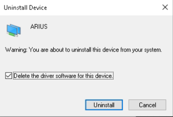

.. _arrus-toolkit-installation:

============
Installation
============

Requirements
============

Operating system:

- Linux: Ubuntu 20.04 or newer is recommended,
- Windows: Windows 10 and Windows 11 are supported.

Before proceeding please also make sure that your us4R/us4R-lite device is
properly connected and enabled in the operating system settings.

For devices with **Thunderbolt-3** interface, please check if your us4R/us4R-lite
is properly connected via Thunderbolt-3 cable and is enabled in your System
Settings and/or Thunderbolt Software:

**Ubuntu 20.04 or newer**

Please check in the system settings → Thunderbolt the "LT Link" device is
authorized.

.. figure:: img/thunderbolt_ubuntu.png
    :scale: 80%

Alternatively, you can activate the thunderbolt device from the command line
using the ``boltctl`` command (e.g. when you don't have access to the
graphical interface).

1. Run ``boltctl`` to determine uuid of the connected device.
2. Run as super user: ``boltctl enroll {uuid} --policy auto``, where ``{uuid}`` should be the uuid of the device.

::

 # boltctl
 o LT-LINK  NVME #4
   ├─ type:          peripheral
   ├─ name:          LT-LINK NVME
   ├─ vendor:        LT-LINK
   ├─ uuid:          00a1809d-414f-1502-ffff-ffffffffffff
   ├─ status:        connected
   │  ├─ domain:     cf030000-0090-8718-23d2-7d0b9a815120
   │  └─ authflags:  none
   ├─ authorized:    fri, 14 jul 2023, 14:18:04
   ├─ connected:     fri, 14 jul 2023, 14:18:04
   └─ stored:        no
 # sudo boltctl enroll 00a1809d-414f-1502-ffff-ffffffffffff --policy auto

**Windows 10**

Please check if the LT Link device is enabled in the Thunderbolt software
installed on your computer.

.. figure:: img/thunderbolt.png
    :scale: 80%

The `Connection status` should read `Connected` (or something similar).

For devices with **Thunderbolt-3** or the **direct PCI-e** connection,
please check if your operating system properly detected us4R/us4R-lite
components:

**Ubuntu 20.04 or newer**

Please check the output of ``lspci | grep e005``. You should see the output
similar to the below:

::

  0000:98:00.0 Unclassified device [0011]: Altera Corporation Device e005
  0000:99:00.0 Unclassified device [0011]: Altera Corporation Device e005

The number of output lines should be equal to the number of us4OEMs in your
us4R/us4R-lite.

.. note::

    NOTE: the above output should **not** contain the suffix ``(rev ff)``.
    If you see this suffix, this means probably you will also get the
    ``Incompatible version firmware … actual ffffffff`` when running ARRUS package.
    Just reconnect the Thunderbolt cable or restart your computer (in case
    your are using the direct PCIe connect) and check the ``lspci`` output again.

**Windows 10**

Please check in the device manager whether there are ``PCI Device`` or ``us4oem``
nodes there, in the number equal to the number of modules that your
us4R/us4R-lite has.

Installing software components separately
=========================================

The ARRUS toolkit consists of the following packages and software:

- `ARRUS <https://github.com/us4useu/arrus/>`_,
- `us4R/us4R-lite driver and utils <https://github.com/us4useu/us4r-drivers>`_,
- device firmware.

You can install each of these components manually, but please remember to use
compatible versions, otherwise you will receive an error message that some two
components are not compatible with each other.

The below table shows which versions are compatible.

 ================================================================================= ========================================================================================================================================================== ================== =================== ==================== ===============
  ARRUS                                                                             Drivers                                                                                                                                                   Us4OEM+ Firmware   Us4OEM Firmware     DBAR-Lite Firmware   DBAR Firmware
 ================================================================================= ========================================================================================================================================================== ================== =================== ==================== ===============
  `v0.10.0 <https://github.com/us4useu/arrus/releases/tag/v0.10.0>`__                 v0.11.0, Linux: `0.10.0 <https://github.com/us4useu/us4r-drivers/releases/download/v0.10.0/us4r-lkm-v0.10.0.run>`__, Windows: WD1450                      2.0.4.0            1.0.1.0, TX: a      0x243a5479           0x705c9732
  `v0.9.3 <https://github.com/us4useu/arrus/releases/tag/v0.9.3>`__                 v0.10.3, Linux: `0.10.0 <https://github.com/us4useu/us4r-drivers/releases/download/v0.10.0/us4r-lkm-v0.10.0.run>`__, Windows: WD1450                      2.0.4.0            1.0.1.0, TX: a      0x243a5479           0x705c9732
  `v0.9.2 <https://github.com/us4useu/arrus/releases/tag/v0.9.2>`__                 v0.10.2, Linux: `0.10.0 <https://github.com/us4useu/us4r-drivers/releases/download/v0.10.0/us4r-lkm-v0.10.0.run>`__, Windows: WD1450                      2.0.4.0            1.0.1.0, TX: a      0x243a5479           0x705c9732
  `v0.9.1 <https://github.com/us4useu/arrus/releases/tag/v0.9.1>`__                 v0.10.1, Linux: `0.10.0 <https://github.com/us4useu/us4r-drivers/releases/download/v0.10.0/us4r-lkm-v0.10.0.run>`__, Windows: WD1450                      2.0.4.0            1.0.1.0, TX: a      0x243a5479           0x705c9732
  `v0.9.0 <https://github.com/us4useu/arrus/releases/tag/v0.9.0>`__                 v0.10.0, Linux: `0.10.0 <https://github.com/us4useu/us4r-drivers/releases/download/v0.10.0/us4r-lkm-v0.10.0.run>`__, Windows: WD1450                      2.0.4.0            1.0.1.0, TX: a      0x243a5479           0x705c9732
  `v0.8.0 <https://github.com/us4useu/arrus/releases/tag/v0.8.0>`__                 v0.9.0, Linux: `0.2.0 <https://github.com/us4useu/us4r-drivers/releases/download/v0.9.0-dev-first/us4r-driver-v0.2.0-dev20221007.run>`__, Windows: WD1450 x                  0x0f255c84, TX: a   0x243a5479           0x705c9732
  `v0.7.8 <https://github.com/us4useu/arrus/releases/tag/v0.7.8>`__                 v0.8.7, Linux: `0.1.5 <https://github.com/us4useu/us4r-drivers/releases/download/v0.8.6/us4r-driver-v0.1.0.run>`__, Windows: WD1450                       x                  0xbd612458, TX: a   0x243a5479           0xffe07334
  `v0.7.7 <https://github.com/us4useu/arrus/releases/tag/v0.7.7>`__                 v0.8.7, Linux: `0.1.5 <https://github.com/us4useu/us4r-drivers/releases/download/v0.8.6/us4r-driver-v0.1.0.run>`__, Windows: WD1450                       x                  0xbd612458, TX: a   0x243a5479           0xffe07334
  `v0.7.6 <https://github.com/us4useu/arrus/releases/tag/v0.7.6>`__                 v0.8.7, Linux: `0.1.5 <https://github.com/us4useu/us4r-drivers/releases/download/v0.8.6/us4r-driver-v0.1.0.run>`__, Windows: WD1450                       x                  0xbd612458, TX: a   0x243a5479           0xffe07334
  `v0.7.5 <https://github.com/us4useu/arrus/releases/tag/v0.7.5>`__                 v0.8.7, Linux: `0.1.5 <https://github.com/us4useu/us4r-drivers/releases/download/v0.8.6/us4r-driver-v0.1.0.run>`__, Windows: WD1450                       x                  0xbd612458, TX: a   0x243a5479           0xffe07334
  `v0.7.4 <https://github.com/us4useu/arrus/releases/tag/v0.7.4>`__                 v0.8.7, Linux: `0.1.5 <https://github.com/us4useu/us4r-drivers/releases/download/v0.8.6/us4r-driver-v0.1.0.run>`__, Windows: WD1450                       x                  0xbd612458, TX: a   0x243a5479           0xffe07334
  `v0.7.3 <https://github.com/us4useu/arrus/releases/tag/v0.7.3>`__                 v0.8.7, Linux: `0.1.5 <https://github.com/us4useu/us4r-drivers/releases/download/v0.8.6/us4r-driver-v0.1.0.run>`__, Windows: WD1450                       x                  0xbd612458, TX: a   0x243a5479           0xffe07334
  `v0.7.2 <https://github.com/us4useu/arrus/releases/tag/v0.7.2>`__                 v0.8.6, Linux: `0.1.5 <https://github.com/us4useu/us4r-drivers/releases/download/v0.8.6/us4r-driver-v0.1.0.run>`__, Windows: WD1450                       x                  0xbd612458, TX: a   0x243a5479           0xffe07334
  `v0.7.1 <https://github.com/us4useu/arrus/releases/tag/v0.7.1>`__                 v0.8.6, Linux: `0.1.5 <https://github.com/us4useu/us4r-drivers/releases/download/v0.8.6/us4r-driver-v0.1.0.run>`__, Windows: WD1450                       x                  0xbd612458, TX: a   0x243a5479           0xffe07334
  `v0.7.0 <https://github.com/us4useu/arrus/releases/tag/v0.7.0>`__                 v0.8.6, Linux: `0.1.5 <https://github.com/us4useu/us4r-drivers/releases/download/v0.8.6/us4r-driver-v0.1.0.run>`__, Windows: WD1450                       x                  0xbd612458, TX: a   0x243a5479           0xffe07334
 ================================================================================= ========================================================================================================================================================== ================== =================== ==================== ===============

Drivers
-------

Linux
~~~~~

Download the linux driver then in command line run:

::

  sudo chmod +x {us4r-driver.run}
  sudo ./{us4r-driver.run}

where ``{us4r-driver.run}`` is the name of the downloaded file.

After executing the above command, there should be ``us4oem*`` nodes in the ``/dev``
folder, e.g.:

::

    # ls /dev/us4oem*
    /dev/us4oem9800  /dev/us4oem9900

.. warning::
    Currently it is necessary to re-run the above installer after every
    Linux Kernel upgrade
    (which can be performed silently in the background by Ubuntu).
    This inconvenience will be fixed in the future.

Windows
~~~~~~~

Uninstall ARIUS drivers (if previously installed)
#################################################

If ARIUS drivers are installed on your computer, uninstall them first. ARIUS
drivers are the legacy drivers that were required before the 0.4.3 version.

1. Open the Windows Device Manager, uninstall all ``ARIUS`` or ``WinDriver1290`` or ``us4oem``
   devices available in the "Jungo Connectivity" node. **Check
   "Delete the driver software for this device"**.

2. Restart computer.

Install Us4OEM drivers
######################

1. Download and extract ``us4oem-drivers-1450.zip`` (contact us4us support to make sure you get the newest version).
2. Run ``install.bat`` with **administrative privileges**. Confirm driver
   installation if necessary.

``us4oem`` and ``WinDriver1450`` nodes should now be visible in the
Device Manager.

.. figure:: img/dev_manager.png
    :scale: 100%

us4OEM+/us4OEM firmware
-----------------------

.. warning::

    Currently the firmware update is supported on Windows only.

Download the appropriate firmware version from this `page <https://github.com/us4useu/us4r-drivers/releases>`__,
extract and run ``update.bat``.

.. figure:: img/firmware_update_result.png
    :scale: 100%

**After the update, please remember to do a full power cycle of the us4R/us4R-lite and the connected PC.**

ARRUS
-----
The list of the ARRUS package releases is available `here <https://github.com/us4useu/arrus/releases>`__.

Download and extract the package for the programming language you want to use.
Follow the necessary steps described below.

Python
~~~~~~

Requirements:

- Python 3.8 (also 3.9 and 3.10 for ARRUS >= 0.9.0),
- NVIDIA CUDA Toolkit >= 10.0.

We recommend using `Miniconda3 <https://docs.conda.io/en/latest/miniconda.html>`__
to manage Python environments.

Install whl package located in the ``python`` subdirectory using
``pip`` package manager:

.. code-block:: console

    pip uninstall arrus
    pip install  arrus-x.y.z-cp38-cp38-win_amd64.whl

Where ``x.y.z`` is the current version of ARRUS package.

The below packages are required to run the example with B-mode imaging:

.. code-block:: console

    pip install cupy-cudaxyz matplotlib

Where ``xyz`` is the version of the CUDA Toolkit installed on your host PC.

To check if everything is OK, run one of the examples provided
`here <https://github.com/us4useu/arrus/tree/master/api/python/examples>`__
and described `here <https://us4useu.github.io/arrus-docs/releases/current/python/content/examples.html>`__. For example, to run ``plane_wave_imaging.py``:

1. Update path in the ``with arrus.Session()...`` call to the ``.prototxt`` for your system.
2. Adjust HV voltage.
3. Run it: ``python plane_wave_imaging.py``.

MATLAB
~~~~~~

Requirements:

- MATLAB 2022a,
- CUDA 11.0 at least.

To check if everything is OK, run one of the scripts available
`here <https://github.com/us4useu/arrus/tree/master/api/matlab/examples>`__.

