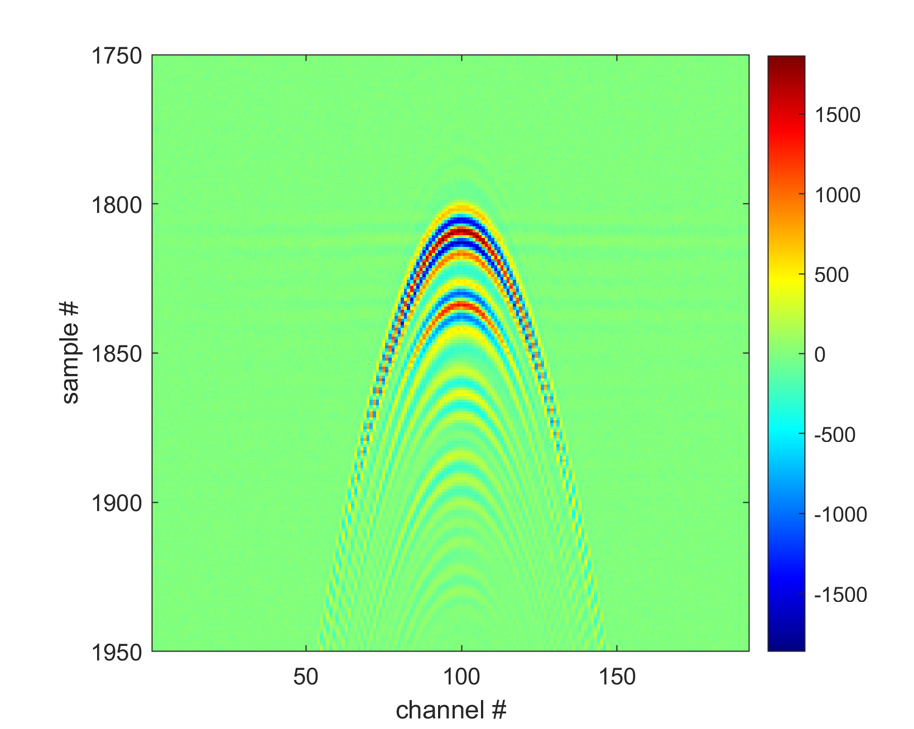

=======================
Connecting custom probe
=======================

In this section, we outline the steps that should be taken when you would like to connect a custom (not officially tested by us4us) probe to the USSS2/us4R-lite/USSS8/us4R system.
If your probe is not on the list of probes supported by us (see the list `here <https://us4useu.github.io/arrus-docs/releases/v0.10.4/python/content/user_guide.html#default-dictionary>`__),
you will likely need to determine the probe parameters and pin-mapping between the probe and the ultrasound system. For that, please refer to the section "Determining pin-mapping."

If your probe model is officially supported by our software, you can simply use this prototxt file, just remember to set the appropriate name of
the adapter and probe model.

Determine pin-mapping
---------------------

First, create a ``us4r.prototxt`` file and put the below content into it.

::

    us4r: {
        probe:
        {
            id: {
                manufacturer: "manufacturer_name"
                name: "probe_model_name"
            }
            # TODO: please set the correct number of probe elements.
            n_elements: 256,

            # TODO: please set the correct pitch. [m]
            pitch: 0.1e-3,

            tx_frequency_range: {
                begin: 1e6,
                end: 15e6
            },
            # NOTE: the voltage limit set below has been chosen to allow safe experimentation when the pin mapping between
            # the probe and the system is not yet well known. Once you are certain about the pin mapping and that no elements
            # are shorted or open, you may increase the `end` value (max: 90 V).
            voltage_range {
                begin: 0,
                end: 10
            }
        }

        adapter_id: {
            manufacturer: "us4us"
            name: "dlp408r"
        }

        probe_to_adapter_connection: {
            # One to one mapping between system channels and probe elements.
            channel_mapping_ranges: [
                {
                    begin: 0
                    end: 255
                }
            ]

            # You can specify your own order using a construction like the one below.
            # Note: the number of elements in the list below should be equal to the number of elements in the probe.
            # channel_mapping: [
            #     250, 254, 242, 246, 232, 236, 224, 228, 218, 222, 210, 214, 200, 204, 192, 196,
            #     186, 190, 178, 182, 168, 172, 160, 164, 154, 158, 146, 150, 136, 140, 128, 132,
            #     131, 135, 139, 143, 145, 149, 153, 157, 163, 167, 171, 175, 177, 181, 185, 189,
            #     195, 199, 203, 207, 209, 213, 217, 221, 227, 231, 235, 239, 241, 245, 249, 253,
            #     129, 133, 137, 141, 147, 151, 155, 159, 161, 165, 169, 173, 179, 183, 187, 191,
            #     193, 197, 201, 205, 211, 215, 219, 223, 225, 229, 233, 237, 243, 247, 251, 255,
            #     126, 122, 118, 114, 108, 104, 100, 96, 94, 90, 86, 82, 76, 72, 68, 64,
            #     62, 58, 54, 50, 44, 40, 36, 32, 30, 26, 22, 18, 12, 8, 4, 0,
            #     124, 120, 116, 112, 110, 106, 102, 98, 92, 88, 84, 80, 78, 74, 70, 66,
            #     60, 56, 52, 48, 46, 42, 38, 34, 28, 24, 20, 16, 14, 10, 6, 2,
            #     5, 1, 13, 9, 23, 19, 31, 27, 37, 33, 45, 41, 55, 51, 63, 59,
            #     69, 65, 77, 73, 87, 83, 95, 91, 101, 97, 109, 105, 119, 115, 127, 123
            # ]
        }

        # Default initial values.
        rx_settings: {
            lna_gain: 24
            pga_gain: 30
            lpf_cutoff: 15000000
            active_termination: 200
        }

        hv: {
            model_id {
                manufacturer: "us4us"
                name: "us4oemhvps"
            }
        }

        channels_mask: {
            channels: []
        }
    }

Then, please set the appropriate:

- adapter name: ``us4r`` → ``adapter_id`` → ``name``,
- number of elements and pitch: ``us4r → ``probe`` → ``n_elements``, ``us4r`` → ``probe`` → ``pitch``,
- number of channels in use: ``us4r`` → ``probe_adapter_to_connection`` → ``channel_mapping_ranges`` → ``end``.

Download the script that allows you to display RF data in real time: `Python <https://github.com/us4useu/arrus/blob/master/api/python/examples/custom_tx_rx_sequence.py>`__, `MATLAB <https://github.com/us4useu/arrus/blob/master/api/matlab/examples/Us4R_control_rawRfPwi.m>`__.
Set the appropriate path to the  ``us4r.prototxt`` file in it (please check the ``arrus.Session`` (Python) or the ``Us4R`` (MATLAB) constructor).

Run the script and check if you can see a correct echo from a point target. This actually will depend on the geometry of the probe, e.g. matrix or linear array. For the linear array probes, you should expect to see a hyperbola like the one below.

If the RF frame doesn't looks right, it will be necessary to adjust the pin mapping between the system channels and the probe elements. To do this, try modifying ``probe_to_adapter_connection`` until you obtain the correct result.
You can read more about the ``probe_to_adapter_connection`` field `here <https://us4useu.github.io/arrus-docs/releases/v0.10.4/python/content/user_guide.html#probe-to-adapter-connection>`__.

Finally, make sure you see a correct RF signal on all channels. If you do not receive a correct signal from a strong reflector at a particular probe element, please mask it by adding it to the list of `masked <https://us4useu.github.io/arrus-docs/releases/v0.10.4/python/content/user_guide.html#channel-masks>`__ elements.
