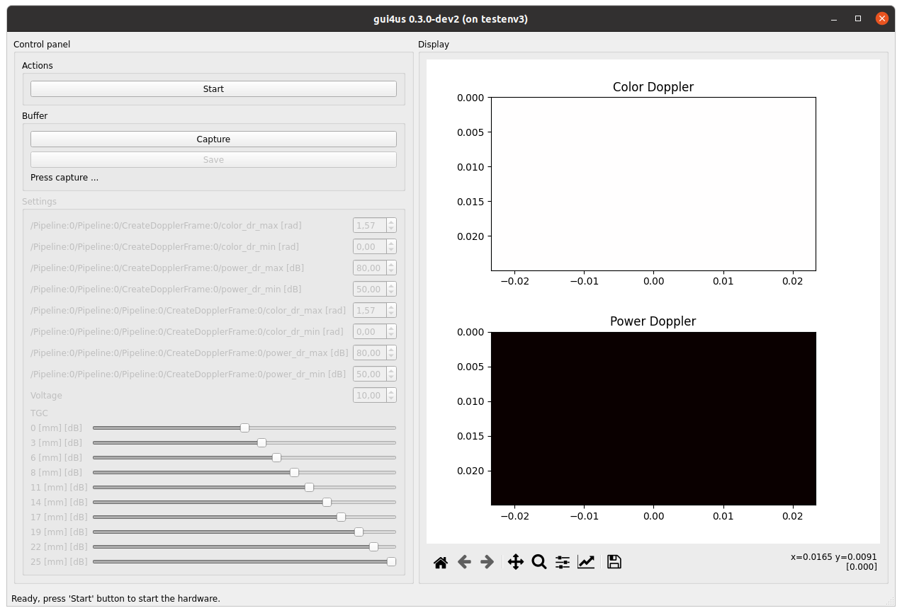

=======================
Color and Power Doppler
=======================

In this document, we present how to run Color and Power Doppler imaging example.

.. caution::

    The example discussed here is a very simple implementation of Color Doppler,
    not intended for medical diagnostics. This implementation consists solely of
    basic flow estimation using the correlation method, without any post-processing,
    image and performance enhancements in particular.

    A medical-grade quality implementation of Color Doppler will soon be made
    available as part of the ``arrus-med`` package.

Intended use
------------

Color/Power Doppler imaging of the **carotid artery**.

Max depth: 20 mm.

Requirements
------------

- us4R or the legacy us4R-lite or us4R-lite+
- a linear array probe with the center frequency ~ 6-8 MHz
- ARRUS Python >= 0.10.0
- cupy >= 12.0.0
- gui4us >= 0.3.0-dev20241008

Dedicated hardware
------------------

The example was developed and tested on the following setup:

- ultrasound system: us4R-lite+ system with the PCI-e interface,
- probe adapter: EPA rev3 (``esaote3``),
- probe: Esaote SL1543 (linear array probe, ~ 8 MHz center frequency).

Installation
------------

1. Download the `color doppler <https://github.com/us4useu/arrus-toolkit/tree/master/examples/linear_array/color_doppler>`_ example (the whole directory).
2. Update the path to the ``us4r.prototxt`` in the ``env.py`` file: the ``session_cfg`` parameter of the ``UltrasoundEnv`` object constructor.

How to run
----------
1. Start the gui4us configuration:

::

    gui4us --cfg /path/to/examples/color_dopper

After successfully launching the application, a window like the one below should appear.

2. Press Start button.
3. Put the ultrasound gel on the probe, place the probe on the neck area over the carotid artery.

Parameters
----------

The following imaging parameters are available to the user (UI):

- ``color_dr_min``, ``color_dr_max``: minimum/maximum Color Doppler data threshold values (*dynamic range*),
- ``power_dr_min``, ``power_dr_max``: minimum/maximum Power Doppler data threshold values (*dynamic range*).

The first four parameters (with the ``/Pipeline:0/Pipeline:0`` prefix),
``color/power_dr_min/max`` are intended for the "Color Doppler" display.
The next four parameters (with the ``/Pipeline:0/Pipeline:0/Pipeline:0`` prefix)
are intended for the "Power Doppler" display.

.. note::

    Power Doppler data is used both in the process of generating Color Doppler and Power Doppler images --
    in particular, we are limiting Color Doppler image to to the area where
    Power Doppler data is within the ``power_dr_min/max`` range.
    Hence, there are two separate sets of parameters, as both Color and Power
    Doppler data can be used to produce Color/Power image streams.

