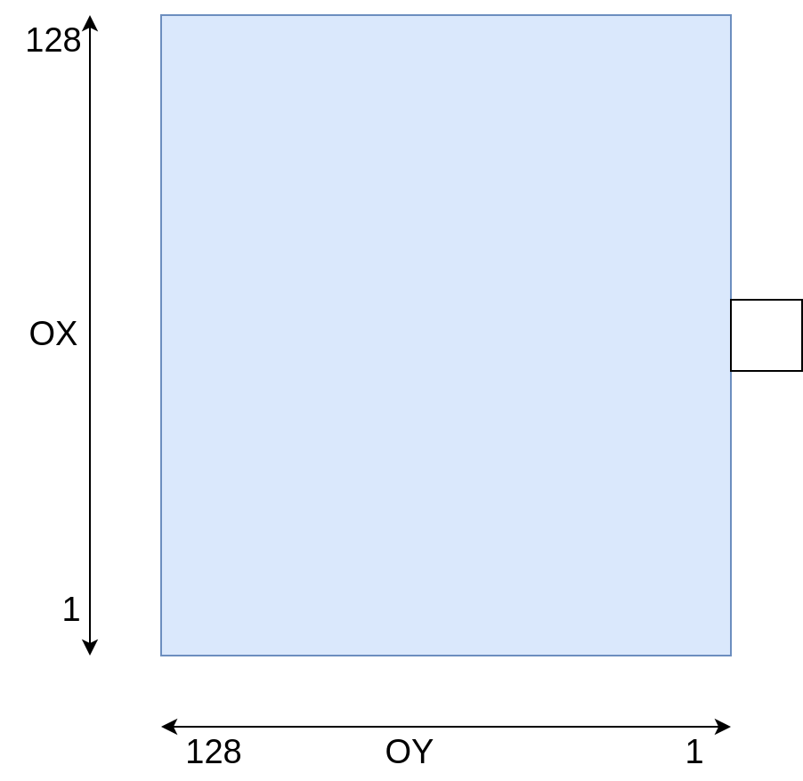
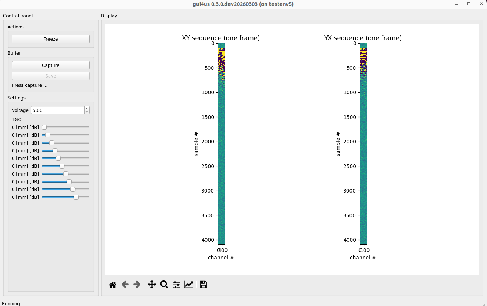
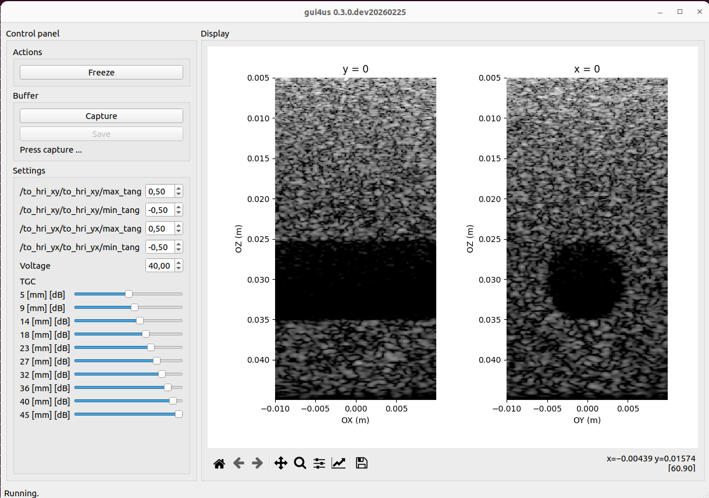
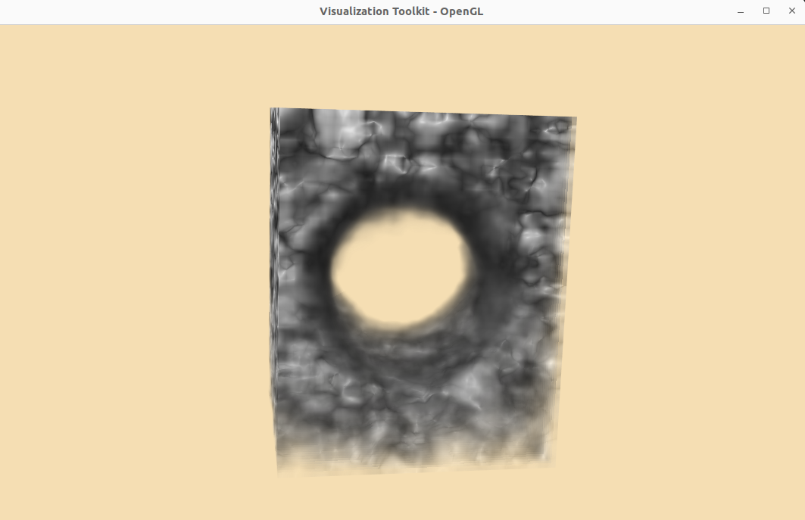

=================================
Row-column Array Probe (RCA)
=================================

In this document we present instructions on how to use the RCA probe with the
us4us us4R-Lite+ ultrasound systems.

This document describes ARRUS-Toolkit examples: ``rca/rf``, ``rca/bmode`` and ``rca/3d``.

Intended use
------------

The example provided here serves as a starting point for testing the RCA probe. It
can be further adapted for specific requirements, such as raw RF data acquisition,
evaluating custom RX beamformers, or testing alternative TX/RX sequences.

Assumptions
-----------

The figure below shows the axis orientation for the Vermon 6 MHz RCA probe.

Requirements
------------

Hardware:

- us4R-lite+ system
- RCA probe (tested on `Vermon RCA 6.0 MHz 128 + 128 <https://vermon.com/product/row-column-array-6-0mhz-256-elts/>`_ probe).

Software:

- ARRUS Python >= 0.13.0
- gui4us >= 0.3.0-dev20260303
- arrus_rca_utils: ``pip install -e /path/to/arrus-toolkit/examples/rca/utils``
- *optionally: VTK >= 9.2.0 for 3D visualization, HoloPlayService 1.2.6 and vtk-lookingglass == 1.0.0 for LookingGlassFactory 1st generation HoloDisplay*

Installation
------------

1. Download example from `rca/ <https://github.com/us4useu/arrus-toolkit/tree/master/examples/rca/>`_ directory (you can also clone the whole arrus-toolkit repository).
2. *Optionally: update the ``us4r.prototxt``: set the proper probe adapter name, probe name, HV model name, pin mapping if necessary.*.

Parameters
~~~~~~~~~~

The examples are adapted for the Vermon RCA 6 MHz probe (128 + 128 elements). 
To adapt it to other probes, please change the probe parameters and pin mapping in the ``us4r.prototxt`` file.

The below parameters can be changed in the ``rca/rf/env.py``, ``rca/bmode/env.py`` or ``rca/3d/run.py``
scripts, in the section e.g.:

We also encourage you to modify other parameters of the TX/RX sequence in the env.py file.
For more information, please refer to the documentation for `ARRUS <https://github.com/us4useu/arrus/releases>`_ release you are using.

RF data 
-------

This section describes ARRUS-Toolkit example: ``rca/rf``.

This example shows how to display raw RF data acquired from the RCA probe in real-time.

How to run
~~~~~~~~~~

1. Make sure the RCA probe is properly connected.
2. Start the example: execute the following command in terminal: ``gui4us --cfg /path/to/examples/rca/rf``, then press Start button.

After successfully launching the application, a window like the one below should appear. The window presents one of the RF frames acquired for each TX/RX sequences.

To stop the system, close the GUI4us window.

2D volume slices in GUI4us
--------------------------

This section describes ARRUS-Toolkit example: ``rca/bmode``.

This example shows how to acquire and reconstruct full 3D volume, and display 2D volume slices in GUI4us.

Currently, GUI4us does not support 3D volume display (however, this will be added in the future). For now, 
you can use the 3D VTK visualizer if you would like to visualize the 3D volume in real-time.

How to run
~~~~~~~~~~

1. Make sure the RCA probe is properly connected.
2. Start the example: execute the following command in terminal: ``gui4us --cfg /path/to/examples/rca/bmode``, then press Start button.

After successfully launching the application, a window like the one below should appear. The window presents B-mode images for planes x = 0 and y = 0.

To stop the system, close the GUI4us window.

3D volume visualization
-----------------------

This section describes ARRUS-Toolkit example: ``rca/3d``.

This example shows how to acquire and reconstruct full 3D volume, and display it in real-time using the 3D VTK visualizer.

Parameters
~~~~~~~~~~

To change the dynamic range, set the ``VTkVisualizer(dr_min and dr_max)`` parameters in the ``rca/3d/run.py`` script.

You can enable the integration with LookingGlassFactory display by setting ``VTkVisualizer(use_lgf=True)`` parameter. NOTE: currently this feature is only supported with 1st 
generation LookingGlassFactory HoloDisplay 8.9", with HoloPlayService 1.2.6. 

How to run
~~~~~~~~~~

1. Make sure the RCA probe is properly connected.
2. Start the example: execute the following command in terminal: ``python /path/to/examples/rca/3d/run.py``.

After successfully launching the application, a window like the one below should appear. The window presents the 3D volume reconstructed from the RCA probe data.

To stop the system, press Ctrl+C in the terminal (multiple times if necessary).

