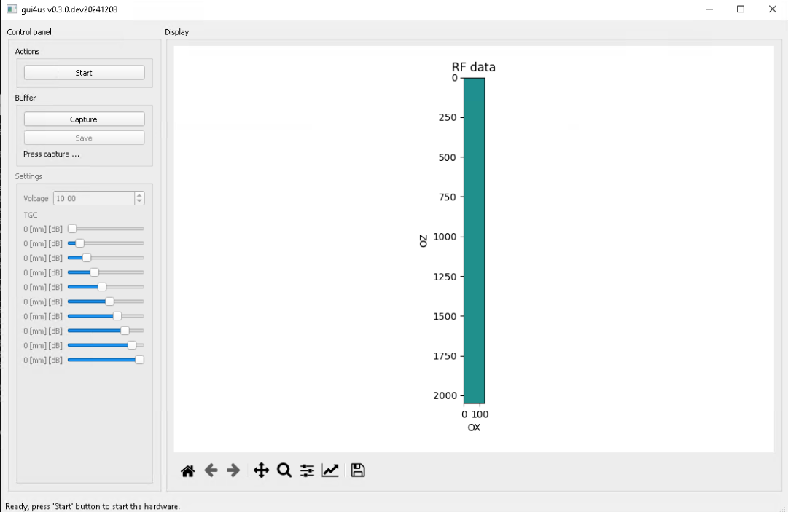
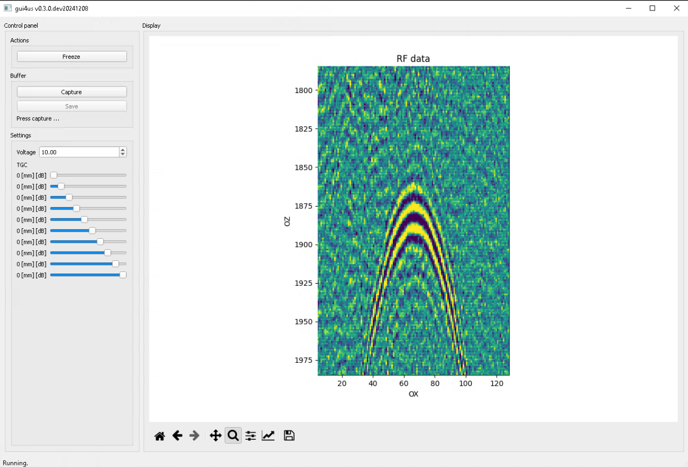

=================================
Connecting external Trigger Input
=================================

In this document we present instructions on how to connect and use an external
trigger generator with the us4us ultrasound systems.

This document describes ARRUS-Toolkit example: ``common/trigger_input``

Intended use
------------

The instruction and example provided here can be applied for whatever application
it is necessary to synchronize the ultrasound system with an external trigger
signal, such as: photo-acoustic imaging, externally controlled transmissions, etc.

The example described here provides access to the raw channel data (RF).

Requirements
------------

Hardware:

- us4R-lite+ system
- General-purpose signal generator

Software:

- ARRUS Python >= 0.11.0
- gui4us >= 0.3.0-dev20241008

Installation
------------

Hardware:

- Connect the signal generator output to the ultrasound system "TRIG IN" port.
- Connect the ultrasound system "CLK OUT" port to the signal generator clock input.

Software:

1. Download the `trigger_input <https://github.com/us4useu/arrus-toolkit/tree/master/examples/common/trigger_input>`_ example (the whole directory).
2. Update the ``us4r.prototxt``: set the proper probe adapter name, probe name, HV model name.

Parameters
----------

General-purpose signal generator
~~~~~~~~~~~~~~~~~~~~~~~~~~~~~~~~

.. caution::

    When a high frequency value is used (>= 100 Hz), we recommend setting the
    n_frames value also sufficiently high (e.g. 100 frames for 100 Hz)
    to mitigate the overhead caused by starting and stopping the transfer
    via the interface between the system and the host PC.

    See also the ``Python scripts`` section for more information.

+-------------+-------------------------------------------------------------------------------------------------------------------------------------------+
| Name        | Value                                                                                                                                     |
+=============+===========================================================================================================================================+
| Frequency   | In accordance with user requirements (max 10 kHz).                                                                                          |
+-------------+-------------------------------------------------------------------------------------------------------------------------------------------+
| Amplitude   | Please see `us4R <https://us4useu.github.io/us4r-user-docs/>`_/`us4R-lite <https://us4useu.github.io/us4r-lite-user-docs/>`_ user manual. |
+-------------+-------------------------------------------------------------------------------------------------------------------------------------------+
| Waveform    | Pulse                                                                                                                                     |
+-------------+-------------------------------------------------------------------------------------------------------------------------------------------+
| Pulse Width | 10 us                                                                                                                                     |
+-------------+-------------------------------------------------------------------------------------------------------------------------------------------+
| Rise edge   | ~ 9 ns                                                                                                                                    |
+-------------+-------------------------------------------------------------------------------------------------------------------------------------------+
| Load        | Please see `us4R <https://us4useu.github.io/us4r-user-docs/>`_/`us4R-lite <https://us4useu.github.io/us4r-lite-user-docs/>`_ user manual. |
+-------------+-------------------------------------------------------------------------------------------------------------------------------------------+

Python scripts
~~~~~~~~~~~~~~

The below parameters can be changed in the ``common/trigger_input/env.py``
script file, in the section e.g.:

::

    # ------------ PARAMETERS
    n_samples = 2048
    n_frames = 100
    tx_aperture = [True]*n_elements
    tx_delays = np.sum(tx_aperture)
    # -------------

+-------------+-----------------------------------------------------------------------------------+
| Name        | Description                                                                       |
+=============+===================================================================================+
| n_frames    | Number of logical frames to be acquired in a single data transfer.                |
|             |                                                                                   |
|             | One logical frame may be translated into multiple physical TX/RX operations,      |
|             |                                                                                   |
|             | depending on the number of elements in your transducer and the number of RX       |
|             |                                                                                   |
|             | channels available in the ultrasonic system.                                      |
|             |                                                                                   |
|             | For example, if 128 elements of the probe are used in RX on the system with       |
|             |                                                                                   |
|             | 64 RX channels, the observed frame rate will be halved.                           |
|             |                                                                                   |
|             | This value should be selected according to the chosen signal generator frequency. |
|             |                                                                                   |
|             | When high frequency values are used (>= 100 Hz), we recommend setting the number  |
|             |                                                                                   |
|             | of frames also sufficiently high to mitigate the overhead caused by starting      |
|             |                                                                                   |
|             | and stopping the transfer via the interface between the system and the host PC.   |
+-------------+-----------------------------------------------------------------------------------+
| tx_aperture | TX aperture definition.                                                           |
|             |                                                                                   |
|             | The TX aperture should be defined as boolean array (mask) for selected probe      |
|             |                                                                                   |
|             | elements to be used in TX.                                                        |
|             |                                                                                   |
|             | For the photo-acoustic application, please consider setting this value            |
|             |                                                                                   |
|             | to ``[False]*n_elements``.                                                        |
+-------------+-----------------------------------------------------------------------------------+
| n_samples   | Number of samples to acquire in a single RX (RF frame). This value determines     |
|             |                                                                                   |
|             | imaging maximum depth.                                                            |
+-------------+-----------------------------------------------------------------------------------+

We also encourage you to modify other parameters of the TX/RX sequence in the env.py file.
For more information, please refer to the documentation for your version of `ARRUS <https://github.com/us4useu/arrus/releases>`_.

How to run
----------

1. Turn on the appropriate output of the signal generator.
2. Start the example, please execute the following command in the terminal:

::

    gui4us --cfg /path/to/examples/common/trigger_input

After successfully launching the application, a window like the one below should appear.

3. Press Start button.

After running the example, the presented RF data should be updated with the frame
according to the frequency set on the generator.

You can acquire data by pressing ``Capture`` button, then by pressing ``Save``.
The data will be saved in the current working directory (i.e. the currently
visited folder in the terminal).

To stop the TX/RX sequence, please close the GUI4us window.

Utils
-----

The ``analyse.ipynb`` notebook shows how to read the data acquired using
the gui4us capture buffer.
